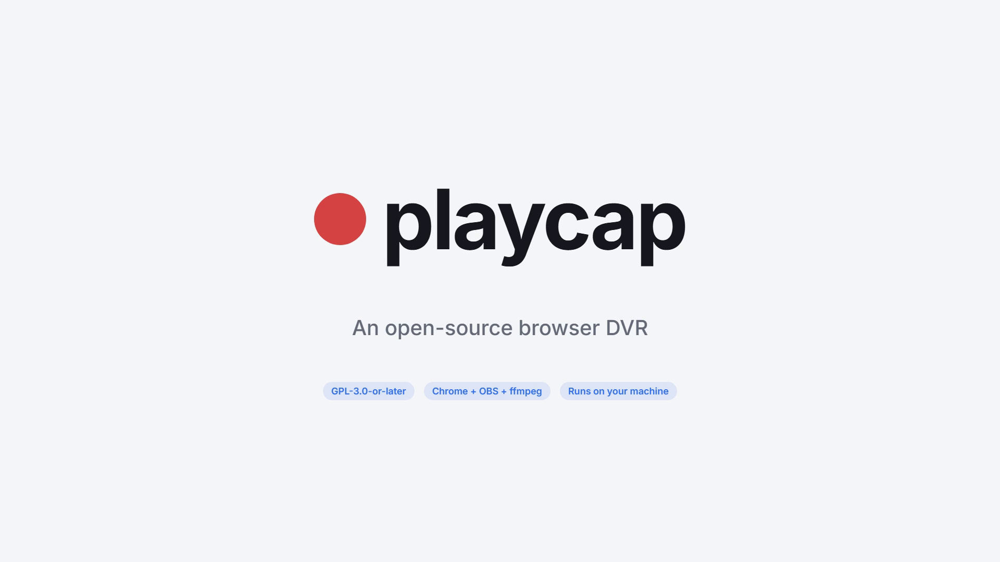

# playcap

An open-source browser DVR. Give it a queue of web pages that play video. It
opens each one in your own Chrome, starts playback, records the screen with
OBS until the video itself reports that it has ended, and files the result as
a verified, compressed media library that Jellyfin or Emby can read.

License: GPL-3.0-or-later.

[](docs/media/playcap-overview.mp4)

*playcap in 60 seconds* ([MP4, 3.5 MB](docs/media/playcap-overview.mp4)). Made from code with
example data only: no real site, account or recording appears in it.

## Why

Scheduled screen recorders start and stop by the clock and know nothing about
playback. Browser-test recorders run headless and record at low quality.
playcap is built for long, unattended runs:

- **Stops when playback ends.** It polls the page's `<video>` (`currentTime`,
  `ended`) rather than guessing a duration.
- **Recovers from stalls.** A frozen player gets nudged, a replaced player
  frame gets re-attached, a failed item is retried after a pause, and a run of
  failures triggers a cooldown instead of failing the whole queue.
- **Resumable.** Progress is saved after every item. A crash or Ctrl+C costs
  at most the item in flight, and a rerun skips finished work. Partial
  recordings are discarded, never mistaken for the real thing.
- **Recorded at the size you choose.** OBS records in constant-quality mode
  (x264 CRF) by default, so a still slide costs almost nothing and the file is
  final. Pick Small, Balanced, High or a fixed bitrate in the UI; playcap
  writes it into OBS's profile while OBS is closed.
- **Optional verified re-compress.** For fixed-bitrate recordings, `optimize`
  re-encodes to CRF 24 and only archives the original once the new file runs
  the full length. Files already recorded at that quality are skipped. AAC
  audio is copied, not re-encoded.
- **Jellyfin/Emby filing.** Episodes are named `SxxEyy - Title` with `.nfo`
  sidecars for the untruncated title, air date and description.
- **Simple local UI.** A setup wizard that finds Chrome, OBS and ffmpeg for
  you and configures OBS itself, then one screen to start/stop recording,
  watch progress (including a black-capture warning), retry or skip items and
  re-compress the library. Runs on `127.0.0.1`, protected against cross-site requests.

## Requirements

- Python 3.10+ and `pip install requests websocket-client` (or `pip install .`)
- Google Chrome or Chromium
- [OBS Studio](https://obsproject.com/) 28+ (the UI switches its WebSocket
  server on and creates a screen-capture scene for you)
- ffmpeg and ffprobe

## Quick start: the UI

```
pip install .            # or: pip install requests websocket-client
playcap ui               # or: python -m playcap ui   (Windows: double-click playcap.bat)
```

Your browser opens on http://127.0.0.1:8765. The first time, a three-step wizard
asks for:

1. **Tools** -- Chrome, OBS, ffmpeg and ffprobe are found automatically; change a
   path only if it picked the wrong one. *Launch OBS* turns on OBS's websocket
   (by editing OBS's own settings while it is closed) and *Set up recording
   scene* adds a full-screen capture scene.
2. **What to record** -- paste page URLs, one per line (`Title | URL` also works).
3. **Library** -- where recordings go and what the series is called.

Then: *Open browser* (log in to your site in that window once -- playcap never
handles passwords), *Refresh queue*, *Start recording*. *Stop after this one*
finishes the item in flight; *Stop now* discards it and keeps it queued.
*Re-compress library* (optional) re-encodes fixed-bitrate recordings; the
recording quality itself is chosen in the wizard's Library step. Settings live in `config.json`
in the folder you started the UI from; you never have to edit it.

Jobs keep running if you close the UI; reopening it picks them up again.

## Quick start: command line (bundled demo, no real site)

`examples/demo/` has a page that plays a six-second generated test pattern,
plus a queue file and a config.

```
cd examples/demo
python ../../build_queue.py           # reads queue.txt -> queue.json
python ../../record_all.py --dry-run  # prints the plan, records nothing
```

To record it for real:

1. Start the debug browser: `python -m playcap.browser` (run it from
   `examples/demo`; it uses a dedicated profile in `browser-profile/`).
2. Start OBS and set `obs_password` in `examples/demo/config.json`.
3. Rehearse: `python -m playcap.tools.smoke_test "file:///.../examples/demo/index.html"`.
   It records 25 seconds and checks that the captured frame is not black.
4. `python ../../record_all.py`, then `python ../../optimize.py` and
   `python ../../status.py`.

For your own queue, copy `config.example.json` to `config.json` at the repo
root and point `queue_source` at a text file of URLs:

```
# one per line; "Title | url" is also accepted
https://example.org/talks/opening-keynote
Closing panel | https://example.org/talks/closing-panel
```

## Commands

| Command | What it does |
| --- | --- |
| `python -m playcap.browser` | Launch Chrome with remote debugging on a dedicated profile |
| `python build_queue.py` | Ask the adapter for the queue and save it |
| `python record_all.py [--dry-run] [--limit N] [--speed 2] [--only KIND]` | Record the queue |
| `python optimize.py [--verify] [--only TEXT] [--crf 24]` | Verified in-place re-encode |
| `python organize.py [--dry-run]` | Rename to `SxxEyy` and write `.nfo` files |
| `python status.py [--watch]` | Write `status.html` |
| `python -m playcap ui` (or `playcap ui`, `python control.py`) | The UI on http://127.0.0.1:8765 |
| `python -m playcap.tools.smoke_test URL` | Rehearse one page end to end |
| `python -m playcap.tools.inspect_live` | Show what the `<video>` in each open tab reports |
| `python -m playcap.tools.probe URL` | Log how a page delivers its video |

The root-level scripts are thin wrappers around `playcap.*`; `python -m
playcap.recorder` and the others work the same way.

## Writing an adapter

Everything site-specific lives in an adapter: a module that defines a class
named `Adapter`, subclassing `playcap.adapters.base.Adapter`. Select it in
`config.json` with `"adapter": "your_module"` (a dotted path to any
importable module).

```python
from playcap import cdp
from playcap.adapters.base import Adapter as Base, Item, Player, VIDEO

class Adapter(Base):
    config_defaults = {"show": "Conference 2026"}

    def build_queue(self, cfg, argv):
        # return a list of JSON-serialisable dicts; saved as the queue file
        return [{"id": "1", "title": "Keynote", "url": "https://example.org/1"}]

    def find_player(self, sess):
        # rect of the element to click and fullscreen, or None if not ready
        return sess.js_json("JSON.stringify((() => { const v = document.querySelector('video');"
                            " if (!v) return null; const r = v.getBoundingClientRect();"
                            " return {x: r.x, y: r.y, w: r.width, h: r.height, src: v.src}; })())")

    def attach_player(self, sess, rect):
        return Player(sess, VIDEO, rect["src"])   # where <video> can be polled

    def fullscreen_js(self, rect):
        return "(async()=>{await document.querySelector('video').requestFullscreen(); return true;})()"
```

Optional hooks: `item(raw)` maps your queue entries onto `Item` (`id`,
`title`, `url`, `kind`, `locked`, `aired_at`), so existing state files can
keep their own shape. `page_target` picks the tab, `check_page` can stop the
run early (for example when the page shows a sign-in form), `reattach_player`
handles a player frame being replaced, `relaunch_browser` and
`browser_command` start your browser, and `labels` changes the wording.
`playcap/adapters/html5_video.py` is a complete, small example.

Adapters must not automate logins, copy sessions or tokens, or work around
device or concurrency limits. See [RESPONSIBLE_USE.md](RESPONSIBLE_USE.md).

Keep private adapters in `local/`. That directory is gitignored, and when
`config.json` has no `"adapter"` key, playcap uses `local.ADAPTER` if a
`local/__init__.py` defines one.

## Architecture

```
config.json ──> playcap.config ──> adapter (playcap.adapters.* or your module)
                                       │
build_queue ── adapter.build_queue ──> queue.json
                                       │
recorder ── per item: page_target -> navigate -> check_page -> find_player
            -> CDP trusted click (start playback) -> rewind to 0 if resumed
            -> fullscreen player -> OBS StartRecord -> poll <video> every 10 s
               (stall nudge, re-attach, pause resume, time budget)
            -> OBS StopRecord -> rename SxxEyy -> remux to faststart mp4 -> .nfo
            -> progress.json (after every item)
                                       │
optimize ── CRF re-encode to a sidecar -> verify duration -> archive original
            -> sidecar takes the episode name -> optimize.json
organize / status / control ── filing, dashboard, local control panel
```

Design notes worth knowing before you change anything:

- CDP input events count as trusted user gestures. Many players only start
  on a real gesture, and a synthetic JavaScript `.click()` does not count.
- Fullscreen the player before recording. Otherwise you capture the page's
  player box instead of the video at its native resolution.
- Some protected video renders black to screen capture while looking fine on
  screen. playcap does not get around that. The smoke test detects it, so you
  find out before a batch.
- A matching duration does not prove an encode is good. Before deleting an
  archived original, decode the whole replacement
  (`ffmpeg -v error -i new.mp4 -f null -`) and require zero output.
- Chrome 136+ refuses `--remote-debugging-port` on the default profile, which
  is why playcap uses a dedicated one.

## Responsible use

playcap records your screen while a page plays in your own browser, the way a
camera pointed at your monitor would.

- **Screen capture only.** playcap does not decrypt DRM, extract streams or
  keys, or download media files.
- **Record only what you are entitled to watch**, and keep recordings for
  your own use where the law and the provider allow it.
- **Respect each site's terms of service.** Many forbid recording. Read them
  first. Whether you may record is your responsibility.
- **No redistribution.** Do not share, upload or sell recordings of content
  you do not own.
- **No access workarounds.** playcap ships no login automation, no session or
  token copying, and nothing that circumvents device or concurrency limits.
  Contributions that add these will not be accepted.

The full statement is in [RESPONSIBLE_USE.md](RESPONSIBLE_USE.md).

## License

GNU General Public License v3.0 or later. See [LICENSE](LICENSE).
