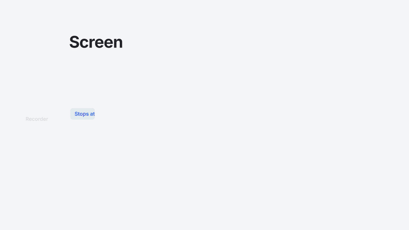

# playcap

[](https://github.com/parvez-ahammed/playcap/actions/workflows/tests.yml)
[](LICENSE)


**Screen recorders stop by the clock. playcap stops when the video does.**

An open-source DVR for web video. Paste 40 links before bed; wake up to a
named, numbered season in your Jellyfin or Plex library. playcap opens each
page in your own Chrome, presses play, records the screen until the video
ends, files the result and moves on to the next one.

[](docs/media/playcap-overview.mp4)

*playcap in 60 seconds.* Click for the [full-quality MP4 (3.5 MB)](docs/media/playcap-overview.mp4).
Made with example data only.

> **A camera pointed at your screen, nothing more.** playcap does not decrypt,
> download or rip anything. Video protected by hardware DRM records **black,
> by design**: playcap detects that, tells you, and skips the item. Record
> only what you are entitled to keep. See [RESPONSIBLE_USE.md](RESPONSIBLE_USE.md).

## Get it

**Windows, no Python needed:** download `playcap-<version>-windows-x64.zip`
from [Releases](https://github.com/parvez-ahammed/playcap/releases), extract
it and double-click `playcap.bat`. Windows may show a SmartScreen warning the
first time (*More info → Run anyway*); the zip's `README.txt` explains how to
check its SHA-256.

**With [uv](https://docs.astral.sh/uv/):** one command, and uv fetches Python
if you don't have it:

```
uvx playcap ui
```

**From source:** `git clone https://github.com/parvez-ahammed/playcap.git`,
then `pip install -e .` and `playcap ui`.

Your browser opens on http://127.0.0.1:8765. Press **Try it now**: playcap
records a six-second test video that ships with it, so you see the whole loop
work before you configure anything.

## What you need

- [Google Chrome](https://www.google.com/chrome/)
- [ffmpeg](https://ffmpeg.org/download.html)
- [OBS Studio](https://obsproject.com/) 28+ *(optional)*: playcap can record
  with ffmpeg alone. OBS is the more mature recorder and mixes system audio
  without extra setup.

Missing something? On Windows each tool has an **Install with winget** button
in the setup screen.

## Why playcap

- **Stops when the video ends**, not at a guessed time. No cut-off endings, no hour of black screen.
- **Runs unattended.** Stuck players get nudged, failed items get retried, and a crash loses at most one video.
- **A library, not a pile.** Files come out numbered and named, or laid out for Jellyfin, Emby, Plex and Kodi, and playcap can ask your media server to rescan after each one.
- **Teach it a site without code.** Click the video and the episode links once; playcap saves that as a shareable [recipe](recipes/) and builds the queue from the index page.
- **Subscribe.** Re-check your pages daily or every few hours and record only what's new.
- **Tells you how it went.** ntfy, Discord, any webhook or a Windows notification when an item is recorded, fails or is blocked.
- **Small files.** Pick the recording quality once; still slides cost almost nothing.

## How it compares

| | playcap | OBS alone | yt-dlp | PlayOn |
| --- | --- | --- | --- | --- |
| How it gets the video | Records the screen | Records the screen | Downloads the file | Records the screen |
| Works on | Any page with an HTML5 player | Anything on screen | Sites with an extractor | A fixed list of services |
| Stops when the video ends | Yes | No, you stop it | n/a | Yes |
| Queue / overnight batches | Yes | No | Yes | Yes |
| Files into a media library | Yes | No | With extra tools | Yes |
| DRM-protected video | Records black, skipped | Records black | Not supported | Vendor-specific |
| Price / licence | Free, GPL-3.0 | Free, GPL-2.0 | Free, Unlicense | Paid, closed |

## Using it

1. **Tools:** Chrome, ffmpeg and (if you use it) OBS are found for you.
2. **What to record:** paste page links one per line, or `collect: <index page>`
   to pull every video link from a listing page using a recipe.
3. **Library:** where recordings go, how they are named, and the quality.
4. Press **Open browser**, sign in to your site once in that window, then
   **Refresh queue** and **Start recording**.

*Stop after this one* finishes the current video; *Stop now* stops straight
away and keeps the video queued for next time.

## Learn more

| | |
| --- | --- |
| [How it works](docs/how-it-works.md) | Architecture, capture backends, black recordings, notifications, scheduling |
| [Command line](docs/command-line.md) | Every command and option, for running without the UI |
| [Recipes](recipes/README.md) | Point-and-click site setup, and how to share a recipe |
| [Writing an adapter](docs/adapters.md) | For players a recipe can't describe |
| [Roadmap](ROADMAP.md) | What's next, and where help is wanted |
| [Responsible use](RESPONSIBLE_USE.md) | What playcap will and will not do |
| [Contributing](CONTRIBUTING.md) | Bug reports, fixes, recipes and adapters |

## Contributing

Bug reports, fixes, recipes for player types and macOS/Linux testing are all
welcome. See [CONTRIBUTING.md](CONTRIBUTING.md) and the
[good first issues](https://github.com/parvez-ahammed/playcap/labels/good%20first%20issue).
If playcap saves you a night of babysitting a recorder, a star helps other
people find it.

## License

GNU General Public License v3.0 or later. See [LICENSE](LICENSE).
